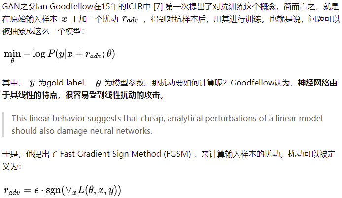
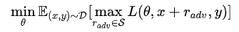
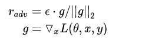
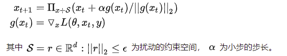

## 对抗训练

### FGSM（**fast gradient sign method）

+ [Explaining and Harnessing Adversarial Examples（2015，ICLR）](https://arxiv.org/abs/1412.6572)

> 文章认为神经网络容易受到对抗性扰动的主要原因是它们的线性特性。对抗训练的两个作用：
>
> 1. 提高模型应对恶意对抗样本时的鲁棒性；
> 2. 作为一种regularization，减少overfitting，提高泛化能力。



### Min-Max 公式

+ [Towards Deep Learning Models Resistant to Adversarial Attacks（2018，ICLR）](https://arxiv.org/abs/1706.06083)

> 将问题重新定义成了一个找鞍点的问题，也就是大名鼎鼎的Min-Max公式：



该公式分为两个部分，一个是内部损失函数的最大化，一个是外部经验风险的最小化。

### FGM

+ [Adversarial Training Methods for Semi-Supervised Text Classification（2017，ICLR）](https://arxiv.org/abs/1605.07725)

> CV任务的输入是连续的RGB的值，而NLP问题中，输入是离散的单词序列，一般以one-hot vector的形式呈现，如果直接在raw text上进行扰动，那么扰动的大小和方向可能都没什么意义。文章提出了可以在连续的embedding上做扰动，乍一思考，觉得这个解决方案似乎特别完美。然而，对比图像领域中直接在原始输入加扰动的做法，在embedding上加扰动会带来这么一个问题：这个被构造出来的“对抗样本”并不能map到某个单词，因此，反过来在inference的时候，对手也没有办法通过修改原始输入得到这样的对抗样本。我们在上面提到，对抗训练有两个作用，一是提高模型对恶意攻击的鲁棒性，二是提高模型的泛化能力。在CV任务，根据经验性的结论，对抗训练往往会使得模型在非对抗样本上的表现变差，然而神奇的是，在NLP任务中，模型的泛化能力反而变强了。因此，**在NLP任务中，对抗训练的角色不再是为了防御基于梯度的恶意攻击，反而更多的是作为一种regularization，提高模型的泛化能力**。



```python
import torch
class FGM():
    def __init__(self, model):
        self.model = model
        self.backup = {}

    def attack(self, epsilon=1., emb_name='emb.'):
        # emb_name这个参数要换成你模型中embedding的参数名
        for name, param in self.model.named_parameters():
            if param.requires_grad and emb_name in name:
                self.backup[name] = param.data.clone()
                norm = torch.norm(param.grad)
                if norm != 0 and not torch.isnan(norm):
                    r_at = epsilon * param.grad / norm
                    param.data.add_(r_at)

    def restore(self, emb_name='emb.'):
        # emb_name这个参数要换成你模型中embedding的参数名
        for name, param in self.model.named_parameters():
            if param.requires_grad and emb_name in name: 
                assert name in self.backup
                param.data = self.backup[name]
        self.backup = {}
```

需要使用对抗训练的时候，只需要添加五行代码：

```python
# 初始化
fgm = FGM(model)
for batch_input, batch_label in data:
    # 正常训练
    loss = model(batch_input, batch_label)
    loss.backward() # 反向传播，得到正常的grad
    # 对抗训练
    fgm.attack() # 在embedding上添加对抗扰动
    loss_adv = model(batch_input, batch_label)
    loss_adv.backward() # 反向传播，并在正常的grad基础上，累加对抗训练的梯度
    fgm.restore() # 恢复embedding参数
    # 梯度下降，更新参数
    optimizer.step()
    model.zero_grad()
```

PyTorch为了节约内存，在backward的时候并不保存中间变量的梯度。因此，如果需要完全照搬原作的实现，需要用`register_hook`接口将embedding后的中间变量的梯度保存成全局变量

### PGD

+ [Towards Deep Learning Models Resistant to Adversarial Attacks（2018，ICLR）](https://arxiv.org/abs/1706.06083)

> FGM简单粗暴的“一步到位”，有可能并不能走到约束内的最优点，PGD的想法是小步走，多走几步。如果走出了扰动半径为 $\epsilon$ 的空间，就映射回“球面”上，以保证扰动不要过大：



```python
import torch
class PGD():
    def __init__(self, model):
        self.model = model
        self.emb_backup = {}
        self.grad_backup = {}

    def attack(self, epsilon=1., alpha=0.3, emb_name='emb.', is_first_attack=False):
        # emb_name这个参数要换成你模型中embedding的参数名
        for name, param in self.model.named_parameters():
            if param.requires_grad and emb_name in name:
                if is_first_attack:
                    self.emb_backup[name] = param.data.clone()
                norm = torch.norm(param.grad)
                if norm != 0 and not torch.isnan(norm):
                    r_at = alpha * param.grad / norm
                    param.data.add_(r_at)
                    param.data = self.project(name, param.data, epsilon)

    def restore(self, emb_name='emb.'):
        # emb_name这个参数要换成你模型中embedding的参数名
        for name, param in self.model.named_parameters():
            if param.requires_grad and emb_name in name: 
                assert name in self.emb_backup
                param.data = self.emb_backup[name]
        self.emb_backup = {}

    def project(self, param_name, param_data, epsilon):
        r = param_data - self.emb_backup[param_name]
        if torch.norm(r) > epsilon:
            r = epsilon * r / torch.norm(r)
        return self.emb_backup[param_name] + r

    def backup_grad(self):
        for name, param in self.model.named_parameters():
            if param.requires_grad:
                self.grad_backup[name] = param.grad.clone()

    def restore_grad(self):
        for name, param in self.model.named_parameters():
            if param.requires_grad:
                param.grad = self.grad_backup[name]
```

+ 使用：

```python
pgd = PGD(model)
K = 3
for batch_input, batch_label in data:
    # 正常训练
    loss = model(batch_input, batch_label)
    loss.backward() # 反向传播，得到正常的grad
    pgd.backup_grad()
    # 对抗训练
    for t in range(K):
        pgd.attack(is_first_attack=(t==0)) # 在embedding上添加对抗扰动, first attack时备份param.data
        if t != K-1:
            model.zero_grad()
        else:
            pgd.restore_grad()
        loss_adv = model(batch_input, batch_label)
        loss_adv.backward() # 反向传播，并在正常的grad基础上，累加对抗训练的梯度
    pgd.restore() # 恢复embedding参数
    # 梯度下降，更新参数
    optimizer.step()
    model.zero_grad()
```


